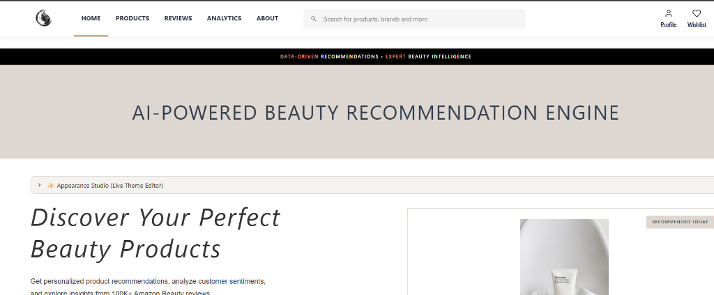
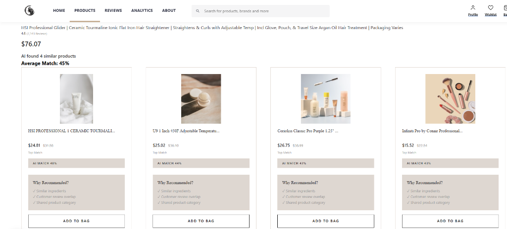
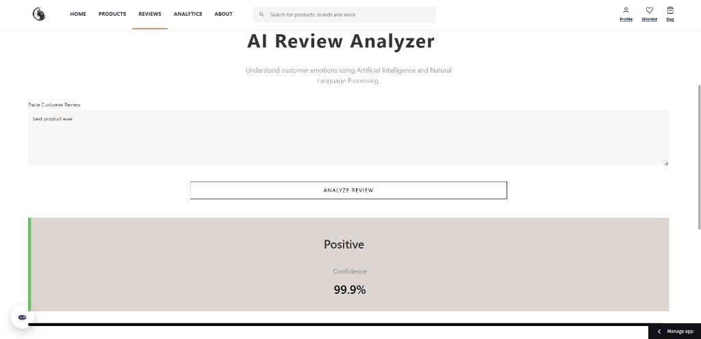
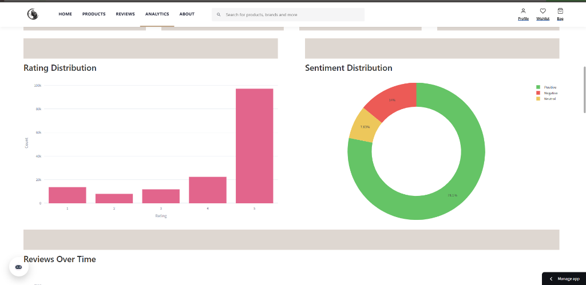
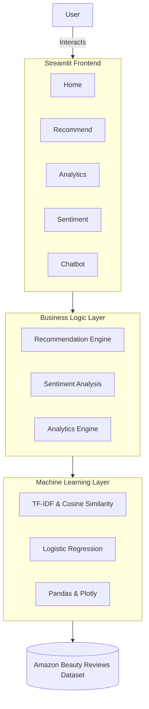
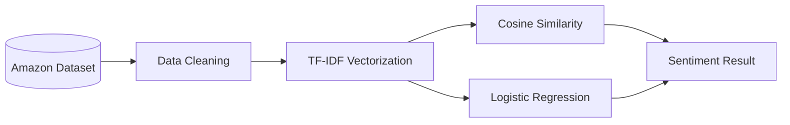

#  BeautyAI – AI-Powered Beauty Product Recommendation System

<p align="center">
  
</p>

<p align="center">
  
  
  
  
  
</p>

An intelligent, AI-powered Beauty Product Recommendation platform designed to enhance the e-commerce shopping experience. BeautyAI helps users discover similar beauty products, analyze customer sentiment, and explore product insights through an interactive, visually stunning dashboard.

---

## 📌 Table of Contents

- [Overview](#-overview)
- [Key Features](#-key-features)
- [Demo](#-demo)
- [System Architecture](#-system-architecture)
- [Tech Stack](#-tech-stack)
- [Project Structure](#-project-structure)
- [Installation & Usage](#-installation--usage)
- [Documentation](#-documentation)
- [Author](#-author)

---

## 🌟 Overview

Finding the right beauty product among millions of options can be overwhelming. **BeautyAI** solves this by leveraging **Natural Language Processing (NLP)** and **Machine Learning** to understand product features and customer reviews, delivering personalized, context-aware recommendations without needing user purchase history.

---

## Key Features

- **AI-Powered Recommendation:** Content-based filtering utilizing TF-IDF and Cosine Similarity.
- 💬 **Sentiment Analysis:** Real-time review classification (Positive/Negative) powered by Logistic Regression.
- **Interactive Analytics Dashboard:** Deep dive into datasets with Plotly data visualizations.
- 💅 **Modern Streamlit UI:** Premium, Apple-inspired aesthetics with interactive recommendation cards.
- **AI Chat Assistant:** Seamless navigational help and product guidance.
- 🎨 **Appearance Studio (Live Theme Editor):** Instantly customize the look and feel of the entire application.

---

## 🎨 Appearance Studio (Live Theme Editor)

A powerful, built-in styling engine that allows you to dynamically change fonts and colors across the entire application in real-time. 

To use it, click on the **✨ Appearance Studio (Live Theme Editor)** expander located just below the top navigation bar on any page. 

### How to Customize the Theme:
1. **Open the Studio:** Click the expander to reveal the live editor.
2. **Select Typography:** Choose from a curated list of premium Google Fonts for both standard text (Primary Font) and titles (Heading Font).
3. **Pick Colors:** Click any color block to open the hex color picker. The UI updates instantly as you drag the selector!
4. **Undo Changes:** Use the convenient `↺` undo buttons next to any color picker to instantly revert that specific color to its previous state.
5. **Save Your Theme:** Click **"Save Theme Changes"**. This automatically embeds your custom theme directly into the URL, ensuring your preferences are saved across refreshes and can easily be shared!
6. **Restore Defaults:** Click **"Restore Original Theme"** to instantly wipe all custom colors and revert to the factory aesthetic.

### Color Mapping Guide (What Changes What?):
- **Primary Accent Color:** Changes the highlighted words in the Hero Section ("Beauty Products"), active navigation tabs, buttons, slider handles, and highlight badges.
- **App Background Color:** Changes the core background color of the main application area.
- **Main Text Color:** Controls the core text color, including the main subtitle text ("Get personalized product recommendations..."), paragraph text, and UI labels.
- **Hero Section Background:** Changes the background color of the banner containing the page title (e.g., the black box behind "AI-POWERED BEAUTY RECOMMENDATION ENGINE").
- **Hero Section Font Color:** Changes the color of the page title itself (e.g., the text "AI-POWERED BEAUTY RECOMMENDATION ENGINE").
- **Action Buttons Background:** Controls the background color of standalone action buttons.
- **Action Buttons Font Color:** Controls the text color inside standalone action buttons.
- **Info & Feature Cards Background:** Changes the background color of product cards and feature boxes.
- **Info & Feature Cards Font Color:** Changes the text color inside the product cards and feature boxes.

---

## 🎥 Demo

> **Try it live!** [BeautyAI Web Application](https://beauty-ai-bhumika.streamlit.app/)

### Professional Screenshots

| Home Page | Recommendation System |
| :---: | :---: |
|  |  |

| Sentiment Analysis | Analytics Dashboard |
| :---: | :---: |
|  |  |

*(Note: Replace placeholders in the `/screenshots/` folder with actual app captures)*

---

## 🏗 System Architecture

### High-Level Architecture



### Machine Learning Pipeline



---

## 🛠 Tech Stack

| Technology | Purpose |
| :--- | :--- |
|  **Python** | Core Language |
|  **Streamlit** | Frontend Web Framework |
|  **Scikit-Learn** | Machine Learning Library |
|  **Pandas & NumPy** | Data Processing |
|  **Plotly** | Interactive Data Visualization |

---

## 📁 Project Structure

```text
BeautyAI/
│
├── app.py                          # Main Streamlit application
├── requirements.txt                # Python dependencies
├── README.md                       # Project documentation
├── LICENSE                         # MIT License
│
├── assets/                         # Static assets (CSS, Icons, Images)
├── data/                           # Dataset (Raw, Processed, Metadata)
├── models/                         # Trained ML models (Pickle files)
├── pages/                          # Streamlit application views
├── utils/                          # Utility modules and ML logic
├── notebooks/                      # Jupyter notebooks for EDA & Training
├── docs/                           # Detailed markdown documentation
└── screenshots/                    # README screenshot assets
```

---

## ⚙ Installation & Usage

### Prerequisites
- Python 3.9 or higher installed on your system.

### Step-by-step Setup

1. **Clone the repository**
```bash
git clone https://github.com/yourusername/BeautyAI.git
cd BeautyAI
```

2. **Create a virtual environment (Recommended)**
```bash
python -m venv venv
# On Windows:
venv\Scripts\activate
# On macOS/Linux:
source venv/bin/activate
```

3. **Install dependencies**
```bash
pip install -r requirements.txt
```

4. **Run the application**
```bash
streamlit run app.py
```
The application will launch in your default web browser at `http://localhost:8501`.

---

## 📖 Documentation

For a deep dive into the engineering and design decisions behind BeautyAI, check out the comprehensive documentation:
- [Project Overview](docs/project-overview.md)
- [System Architecture](docs/system-architecture.md)
- [Dataset](docs/dataset.md)
- [Recommendation System](docs/recommendation-system.md)
- [Sentiment Analysis](docs/sentiment-analysis.md)
- [Analytics Dashboard](docs/analytics-dashboard.md)
- [UI/UX Design](docs/ui-ux-design.md)
- [Code Documentation](docs/code-documentation.md)
- [Future Enhancements](docs/future-enhancements.md)

---

## Author

**Bhumika Sharma**
*B.Tech (Artificial Intelligence & Data Science)*
Full Stack Developer | Data Analyst | AI Enthusiast
