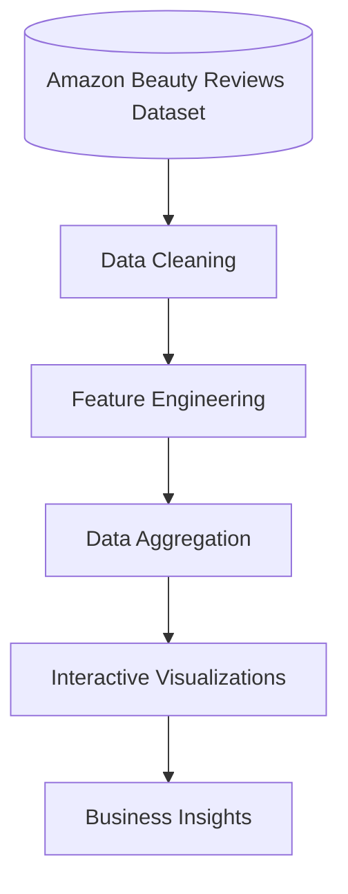
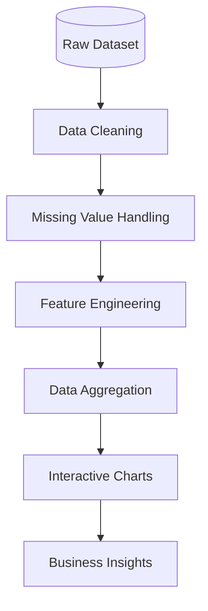

# Analytics Dashboard Documentation

## Overview

The Analytics Dashboard is an interactive module within BeautyAI that enables users to explore customer review data through visualizations and key performance metrics. It converts raw review data into meaningful insights, helping users understand product performance, customer behavior, and market trends.

The dashboard supports exploratory data analysis (EDA) and business decision-making by presenting information in an intuitive and interactive format.

## Objective

The Analytics Dashboard aims to:
- Analyze customer review patterns.
- Visualize product performance.
- Identify popular beauty products and categories.
- Explore customer rating distributions.
- Support data-driven decision-making through interactive dashboards.

## Dashboard Architecture

## Dashboard Modules

The Analytics Dashboard consists of several analytical components tailored to the dataset.

### 1. Interactive Global Filters
Allows dynamic filtering of all visualizations on the dashboard based on user selection.
- **Filters:** Rating (e.g., 5 Stars, 4 Stars), Product Category, and Verified Purchases.

### 2. Overall KPIs (Key Performance Indicators)
Provides a high-level summary of the dataset based on current filters.
- **Metrics:** Total Reviews analyzed, Total Unique Products, Average Rating, and ML Accuracy (Sentiment precision).

### 3. Rating Distribution
Displays the distribution of customer ratings to quickly gauge overall satisfaction.
- **Insights:** Most common rating values and overall customer satisfaction.
- **Visualization:** Bar Chart

### 4. Sentiment Distribution
Visualizes the emotional tone of the filtered reviews using the output of the ML sentiment pipeline.
- **Insights:** Proportion of positive, negative, and neutral/mixed reviews.
- **Visualization:** Pie Chart

### 5. Reviews Over Time (Timeline)
Analyzes review activity over time to track product momentum.
- **Insights:** Review trends, seasonal activity, and growth in customer engagement.
- **Visualization:** Line Chart

### 6. Most Common Words (Word Cloud)
Extracts and visualizes the most frequently occurring terms in customer reviews.
- **Insights:** Common customer complaints, praises, and product attributes.
- **Visualization:** Word Cloud

### 7. Top Products
Highlights the highest-performing items based on review volume within the selected filters.
- **Insights:** Identifies popular products and high customer engagement items.
- **Visualization:** Interactive Recommendation Cards

### 8. Recent Customer Reviews
Provides a searchable data table of the latest reviews.
- **Insights:** Deep dive into specific raw customer feedback (Headline, Body, Rating).
- **Visualization:** Searchable Data Table with CSV Export capabilities.

## Data Processing Pipeline

The analytics module follows a structured workflow before generating visualizations.

## Technologies Used

| Component | Technology |
|---|---|
| Programming Language | Python |
| Data Processing | Pandas |
| Numerical Computing | NumPy |
| Visualization | Plotly |
| Additional Charts | Matplotlib, WordCloud |
| Dashboard Framework | Streamlit |

## Key Business Insights

The Analytics Dashboard enables users to:
- Identify top-performing beauty products.
- Analyze customer satisfaction through ratings.
- Explore category-wise product performance.
- Monitor emotional customer sentiment dynamically.
- Understand purchasing behavior through verified purchases.
- Discover review trends over time.

These insights help businesses make informed decisions related to product development, marketing strategies, and customer experience.

## Advantages

The Analytics Dashboard offers several benefits:
- Interactive and user-friendly visualizations.
- Real-time exploration of review data.
- Supports business intelligence and exploratory data analysis.
- Simplifies interpretation of large datasets.
- Integrates seamlessly with the recommendation and sentiment modules.

## Limitations

Current limitations include:
- Dashboard insights are based on historical review data.
- No real-time data streaming.
- Product pricing and sales data are not available.
- Geographic analysis is not supported due to dataset limitations.

## Future Enhancements

Planned improvements include:
- Brand-wise analytics.
- Product comparison dashboard.
- Customer segmentation analysis.
- Geographic visualization of customer reviews.
- Real-time analytics using live review data.
- Export reports directly as PDF.

## Conclusion

The Analytics Dashboard transforms raw customer review data into meaningful visual insights that support data-driven decision-making. By combining data preprocessing, aggregation, and interactive visualizations, BeautyAI enables users to explore trends, evaluate product performance, and gain a deeper understanding of customer behavior within the beauty product ecosystem.
