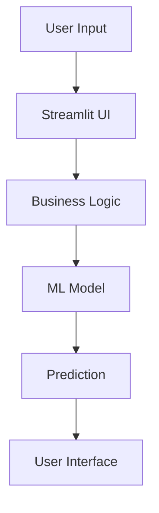

# Code Documentation

## Overview

BeautyAI follows a modular project structure to ensure readability, maintainability, and scalability. The application is divided into independent modules, each responsible for a specific functionality such as data loading, recommendation generation, sentiment analysis, analytics, and user interface rendering.

This separation of concerns makes the codebase easier to understand, test, and extend.

## Project Structure

```text
BeautyAI/
│
├── app.py                  # Main Streamlit application
├── pages/                  # Application pages
├── models/                 # Trained ML models
├── data/                   # Dataset
├── utils/                  # Utility modules
├── assets/                 # Images, CSS, icons
├── docs/                   # Project documentation
├── requirements.txt
└── README.md
```

## Module Description

### `app.py`
**Purpose:** Acts as the application's entry point.

**Responsibilities:**
- Initializes the Streamlit application
- Configures page settings
- Loads global styles
- Displays the Home page
- Provides navigation to all modules

### `pages/`
Contains all user-facing application pages.

**Recommendation Page**
- **Responsibilities:** Accept product input, Generate recommendations, Display recommended products

**Sentiment Analysis Page**
- **Responsibilities:** Accept review text, Perform sentiment prediction, Display classification result

**Analytics Page**
- **Responsibilities:** Load processed dataset, Generate visualizations, Display business insights

**About Page**
- **Responsibilities:** Project overview, Technology stack, Developer information

**Chatbot Page**
- **Responsibilities:** User interaction, AI-assisted guidance, General application support

### `utils/` Package
Utility modules contain reusable business logic.

**`recommendation.py`**
- **Purpose:** Implements the recommendation engine.
- **Major Functions:** `load_recommendation_model()`, `recommend_products()`, `calculate_similarity()`
- **Responsibilities:** Load TF-IDF vectorizer, Compute similarity, Return top recommendations

**`sentiment.py`**
- **Purpose:** Performs sentiment prediction.
- **Major Functions:** `load_sentiment_model()`, `preprocess_text()`, `predict_sentiment()`
- **Responsibilities:** Clean text, Convert to TF-IDF, Predict sentiment

**`analytics.py`**
- **Purpose:** Generates dashboard insights.
- **Responsibilities:** Aggregate data, Compute statistics, Prepare charts

**`preprocessing.py`**
- **Purpose:** Contains data preprocessing functions.
- **Responsibilities:** Remove duplicates, Handle missing values, Text cleaning, Feature engineering

**`data_loader.py`**
- **Purpose:** Loads datasets and trained models.
- **Responsibilities:** Load CSV/Parquet files, Load pickle files, Cache frequently used data

## Machine Learning Models

### Recommendation Model
- **Algorithm:** TF-IDF, Cosine Similarity
- **Input:** Product title
- **Output:** Top similar products

### Sentiment Model
- **Algorithm:** Logistic Regression
- **Input:** Customer review
- **Output:** Positive / Negative

## Data Flow



## Error Handling

The application includes basic validation for:
- Empty product selection
- Empty review input
- Missing dataset
- Missing model files
- Invalid user input

Appropriate messages are displayed to guide the user when an error occurs.

## Coding Standards

The project follows standard Python development practices:
- Modular architecture
- Descriptive variable names
- Reusable functions
- Separation of concerns
- Relative file paths
- Consistent formatting
- Inline comments for complex logic

## External Libraries

| Library | Purpose |
|---|---|
| Streamlit | Web application framework |
| Pandas | Data manipulation |
| NumPy | Numerical operations |
| Scikit-learn | Machine learning |
| Plotly | Interactive visualizations |
| Matplotlib | Static charts |
| Joblib | Model serialization |
| Pillow | Image processing |

## Performance Considerations

To improve efficiency, the application uses:
- Cached data loading
- Pre-trained machine learning models
- Efficient TF-IDF feature representation
- Lightweight inference using Logistic Regression
- Modular utility functions for code reuse

## Future Refactoring

Possible improvements include:
- Add unit tests using pytest
- Introduce logging for debugging
- Add configuration management with .env
- Improve exception handling
- Introduce API layer using FastAPI
- Containerize the application using Docker
- Migrate frontend to Next.js while reusing the existing Python backend

## Code Quality Goals

The BeautyAI codebase is designed to achieve:
- Readability
- Maintainability
- Reusability
- Scalability
- Modularity

These principles ensure that the project can be easily understood, extended, and maintained by future contributors or developers.

## Conclusion

The BeautyAI codebase follows a modular and organized architecture, separating user interface, business logic, machine learning models, and data processing into independent components. This design improves maintainability, simplifies debugging, and provides a solid foundation for future enhancements such as API integration, cloud deployment, and a modern frontend.
