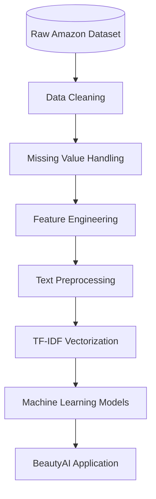

# Dataset Documentation

## Overview

BeautyAI is built using the Amazon Beauty Reviews Dataset, which contains customer reviews and product metadata from Amazon's Beauty category.

The dataset serves as the foundation for recommendation generation, sentiment analysis, and business analytics.

## Dataset Source

- **Dataset Name:** Amazon US Customer Reviews – Beauty
- **Source:** Kaggle
- **Category:** Beauty Products

## Business Objective

The dataset enables the development of an intelligent recommendation platform that helps users:

- Discover similar beauty products
- Analyze customer opinions
- Understand market trends
- Explore product performance

## Dataset Features

| Feature | Description |
|---|---|
| marketplace | Marketplace identifier |
| customer_id | Unique customer ID |
| review_id | Unique review identifier |
| product_id | Product ID (ASIN) |
| product_parent | Parent product identifier |
| product_title | Product name |
| product_category | Product category |
| star_rating | Customer rating (1–5) |
| helpful_votes | Helpful votes received |
| total_votes | Total votes |
| vine | Vine review indicator |
| verified_purchase | Verified purchase status |
| review_headline | Review title |
| review_body | Customer review text |
| review_date | Date of review |

## Data Cleaning

The raw dataset underwent several preprocessing steps:

- Removed duplicate reviews
- Handled missing values
- Standardized text formatting
- Converted review dates to datetime format
- Removed unnecessary columns for model training
- Filtered invalid records

## Feature Engineering

Additional features were created to improve model performance:

- Combined textual information
- Text normalization
- Lowercasing
- Punctuation removal
- Stopword removal
- Tokenization
- TF-IDF feature vectors

## Dataset Usage

The cleaned dataset supports three primary modules:

### Recommendation System

- **Uses:** Product title, Review text, TF-IDF features
- **Output:** Similar product recommendations based on textual similarity.

### Sentiment Analysis

- **Uses:** Review text
- **Output:** Positive or Negative sentiment prediction.

### Analytics Dashboard

- **Uses:** Ratings, Categories, Review dates, Helpful votes
- **Generates interactive visualizations and business insights.**

## Data Pipeline

## Dataset Limitations

- Product images are not included.
- Limited product metadata beyond reviews and identifiers.
- Recommendation quality depends on review richness.
- Some products have very few reviews, reducing similarity accuracy.

## Future Improvements

- Integrate real product images.
- Add pricing information.
- Include brand-level metadata.
- Enrich product descriptions from external sources.
- Support multilingual reviews.
