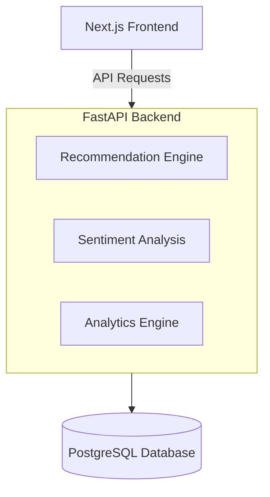

# Future Enhancements

## Overview

BeautyAI has been designed with a modular architecture, making it easy to extend with additional features and advanced AI capabilities. While the current implementation successfully delivers product recommendations, sentiment analysis, and interactive analytics, several enhancements can further improve scalability, user experience, and recommendation quality.

## 1. Hybrid Recommendation System

**Current**
- Content-Based Filtering using TF-IDF and Cosine Similarity.

**Future**
- Implement a Hybrid Recommendation System by combining:
  - Content-Based Filtering
  - Collaborative Filtering
  - Popularity-Based Recommendations

**Benefits**
- More personalized recommendations
- Better handling of new and returning users
- Improved recommendation accuracy

## 2. Deep Learning-Based Recommendations

Replace traditional TF-IDF features with modern embedding techniques.

**Possible models:**
- Sentence Transformers
- BERT
- RoBERTa
- Universal Sentence Encoder

**Benefits:**
- Better semantic understanding
- Improved recommendation quality
- More context-aware product matching

## 3. Advanced NLP Models

Upgrade the current sentiment analysis pipeline.

**Possible improvements:**
- BERT
- DistilBERT
- RoBERTa
- DeBERTa

**Additional capabilities:**
- Multi-class sentiment classification
- Emotion detection
- Aspect-Based Sentiment Analysis (ABSA)

## 4. Personalized User Profiles

Allow users to create accounts and save preferences.

**Features:**
- Favorite products
- Wishlist
- Browsing history
- Recently viewed products
- Personalized recommendations

## 5. Product Image Integration

Enhance recommendation cards with product images.

**Possible approaches:**
- Product image database
- Cloud image storage
- External APIs
- Category-based placeholder images

**Benefits:**
- Better visual appeal
- Improved user engagement
- Richer shopping experience

## 6. Advanced Search & Filtering

Introduce more powerful search capabilities.

**Filters may include:**
- Brand
- Product Category
- Price Range
- Rating
- Sentiment Score
- Verified Purchases

## 7. Product Comparison

Allow users to compare multiple products side by side.

**Comparison parameters:**
- Ratings
- Customer Reviews
- Sentiment
- Product Features
- Recommendation Score

## 8. Explainable AI (XAI)

Increase transparency by explaining recommendations.

**Example:**
> "This product is recommended because it shares similar ingredients, review keywords, and customer feedback with your selected product."

**Benefits:**
- Improved user trust
- Better understanding of AI decisions

## 9. Conversational AI Assistant

Expand the chatbot into an intelligent beauty assistant.

**Potential features:**
- Personalized product recommendations
- Skincare routine suggestions
- Product FAQs
- Recommendation explanations
- Natural language product search

## 10. Cloud Deployment

Deploy the application using cloud platforms.

**Possible options:**
- Streamlit Community Cloud
- Render
- AWS
- Azure
- Google Cloud Platform

**Benefits:**
- Public accessibility
- Easy sharing
- Scalable infrastructure

## 11. Modern Full-Stack Architecture

Transform BeautyAI into a production-ready web application.

**Proposed Architecture:**

**Benefits:**
- Better UI/UX
- Improved scalability
- Responsive design
- Separation of frontend and backend
- Easier integration with external services

## 12. Database Integration

Replace local parquet/CSV files with a relational database.

**Possible databases:**
- PostgreSQL
- MySQL
- MongoDB

**Advantages:**
- Faster data retrieval
- Better scalability
- Efficient data management
- Support for user accounts

## 13. Real-Time Analytics

Integrate live analytics capabilities.

**Examples:**
- Real-time review monitoring
- Live dashboard updates
- Dynamic recommendation refresh
- Performance monitoring

## 14. Mobile-Friendly Experience

Improve accessibility across devices.

**Future improvements:**
- Fully responsive layouts
- Progressive Web App (PWA)
- Android/iOS application
- Mobile-optimized navigation

## 15. Security Enhancements

Strengthen application security.

**Potential additions:**
- User authentication
- Role-based access control
- Secure API endpoints
- Data encryption
- Environment variable management

## 16. Performance Optimization

Optimize application performance.

**Possible improvements:**
- Lazy loading
- Image optimization
- Caching strategies
- Database indexing
- Faster recommendation retrieval

## Future Roadmap

| Phase | Enhancement |
|---|---|
| Phase 1 | Product Images & Enhanced Recommendation Cards |
| Phase 2 | Advanced Search & Product Comparison |
| Phase 3 | User Authentication & Personalized Profiles |
| Phase 4 | Hybrid Recommendation System |
| Phase 5 | Transformer-Based NLP Models |
| Phase 6 | Next.js + FastAPI Migration |
| Phase 7 | Cloud Deployment & Database Integration |

## Conclusion

BeautyAI has been built with extensibility in mind, allowing it to evolve from a machine learning prototype into a scalable, production-ready AI platform. Future enhancements will focus on improving recommendation quality, expanding NLP capabilities, modernizing the user interface, and strengthening system scalability and performance. These improvements will enable BeautyAI to provide a richer, more personalized, and more intelligent user experience while supporting real-world deployment scenarios.
