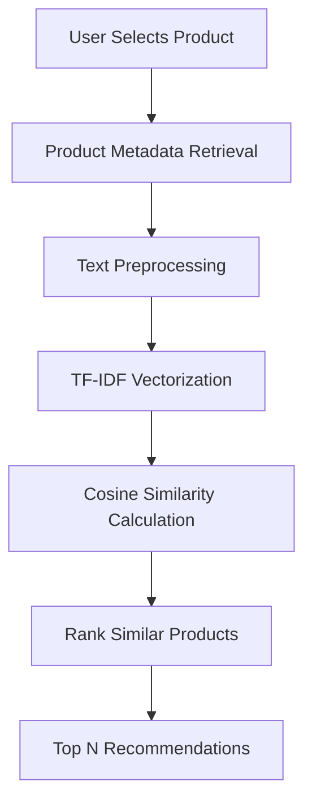
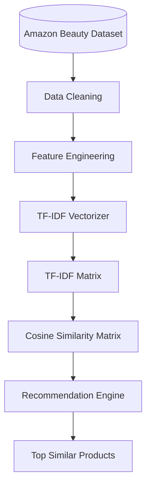

# Recommendation System Documentation

## Overview

The BeautyAI Recommendation System is designed to provide personalized product suggestions by identifying products that are similar in terms of textual content. It employs a Content-Based Filtering approach, where recommendations are generated based on product descriptions, metadata, and customer review information rather than user purchase history.

Unlike collaborative filtering, this approach does not require user interaction data, making it suitable for applications where historical user preferences are unavailable.

## Problem Statement

Customers often struggle to discover beauty products that closely match their preferences due to the vast number of products available on e-commerce platforms.

The objective of the recommendation system is to:
- Recommend products similar to the selected product.
- Improve product discovery.
- Enhance customer shopping experience.
- Increase engagement through personalized recommendations.

## Recommendation Technique

BeautyAI uses **Content-Based Filtering**.

The recommendation engine compares products based on their textual features and recommends products with the highest similarity scores.

**Why Content-Based Filtering?**
Content-Based Filtering was selected because:
- No user purchase history is required.
- Works well with textual product information.
- Easy to scale for new products.
- Generates interpretable recommendations.
- Suitable for the Amazon Beauty Reviews dataset.

## Recommendation Pipeline

## Text Preprocessing

Before generating recommendations, textual data undergoes preprocessing to improve quality and consistency.

The preprocessing pipeline includes:
- Converting text to lowercase
- Removing punctuation
- Removing special characters
- Removing extra whitespace
- Removing stop words
- Combining relevant textual features
- Preparing clean text for vectorization

These steps reduce noise and improve similarity calculations.

## Feature Extraction

The cleaned product text is converted into numerical vectors using **Term Frequency–Inverse Document Frequency (TF-IDF)**.

TF-IDF captures the importance of each word within a product description while reducing the influence of commonly occurring words.

**Advantages of TF-IDF include:**
- Lightweight and efficient
- Suitable for sparse text data
- Captures meaningful keywords
- Improves recommendation quality

## Similarity Calculation

After vectorization, product similarity is computed using **Cosine Similarity**.

Cosine Similarity measures the angle between two TF-IDF vectors rather than comparing raw word counts.

**Similarity values range from:**
- `1.0` → Highly similar products
- `0.0` → Completely unrelated products

Products are ranked according to their similarity scores, and the highest-ranked products are returned as recommendations.

## Recommendation Workflow

## Recommendation Algorithm

The recommendation process follows these steps:
1. Accept the selected product from the user.
2. Locate the product within the processed dataset.
3. Retrieve the corresponding TF-IDF vector.
4. Calculate cosine similarity against all other products.
5. Rank products by similarity score.
6. Remove the selected product from the results.
7. Return the top recommended products.

## Technologies Used

| Component | Technology |
|---|---|
| Programming Language | Python |
| Data Processing | Pandas |
| Machine Learning | Scikit-learn |
| Feature Extraction | TF-IDF Vectorizer |
| Similarity Metric | Cosine Similarity |
| User Interface | Streamlit |

## Advantages

The recommendation system offers several benefits:
- Fast recommendation generation
- No dependency on user history
- Personalized recommendations based on product content
- Scalable for large product catalogs
- Easy to understand and maintain

## Limitations

Despite its effectiveness, the current implementation has some limitations:
- Recommendations depend on the quality of textual data.
- User preferences are not considered.
- Products with limited review content may receive less accurate recommendations.
- Product images and pricing are not incorporated into the recommendation process.

## Future Enhancements

The recommendation engine can be further improved by introducing:
- Hybrid Recommendation System (Content-Based + Collaborative Filtering)
- Semantic embeddings using Sentence Transformers
- Deep Learning–based recommendation models
- Personalized user profiles
- Real-time recommendation APIs
- Product image similarity
- User feedback integration
- Brand and category-aware recommendations

## Conclusion

The BeautyAI Recommendation System demonstrates how Natural Language Processing and Machine Learning can be combined to build an effective content-based recommendation engine. By leveraging TF-IDF vectorization and Cosine Similarity, the system efficiently identifies similar beauty products and provides meaningful recommendations without requiring historical user interaction data.
