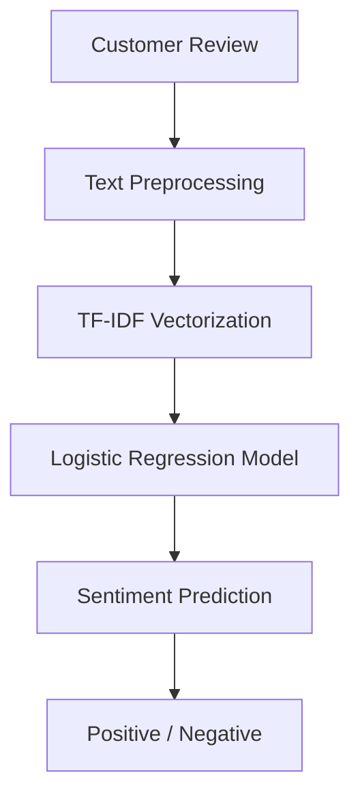
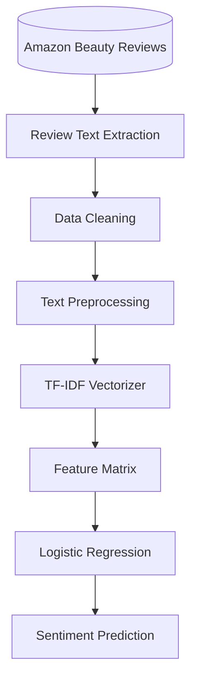

# Sentiment Analysis Documentation

## Overview

The Sentiment Analysis module in BeautyAI is designed to automatically classify customer reviews as Positive or Negative. By leveraging Natural Language Processing (NLP) and Machine Learning, the system helps users understand customer opinions and product satisfaction based on textual reviews.

This feature provides valuable insights into customer experiences and complements the recommendation system by analyzing the emotional tone of product reviews.

## Problem Statement

Customer reviews contain valuable information about product quality, usability, and overall customer satisfaction. However, manually analyzing thousands of reviews is time-consuming and impractical.

The objective of the sentiment analysis module is to:
- Automatically classify customer reviews.
- Identify positive and negative customer opinions.
- Support data-driven purchasing decisions.
- Provide quick insights into customer feedback.

## Approach

BeautyAI uses a Supervised Machine Learning approach for sentiment classification.

The model is trained using labeled review data, where customer reviews are categorized into predefined sentiment classes.

## NLP Pipeline

The sentiment analysis workflow consists of several stages.

## Text Preprocessing

Before training and prediction, review text is cleaned to remove noise and improve model performance.

The preprocessing pipeline includes:
- Converting text to lowercase
- Removing punctuation
- Removing special characters
- Removing numerical values (if applicable)
- Removing extra whitespace
- Removing stop words
- Tokenizing text
- Preparing clean text for feature extraction

These steps ensure consistency across all reviews.

## Feature Extraction

Customer reviews are transformed into numerical feature vectors using **TF-IDF (Term Frequency–Inverse Document Frequency)**.

TF-IDF measures the importance of each word within a review while reducing the influence of frequently occurring words.

**Benefits of TF-IDF include:**
- Efficient text representation
- Reduced impact of common words
- Improved classification performance
- Suitable for large text datasets

## Machine Learning Model

The sentiment classifier is built using **Logistic Regression**.

Logistic Regression was selected because it:
- Performs well on text classification tasks
- Is computationally efficient
- Produces interpretable predictions
- Works effectively with TF-IDF features
- Provides fast inference for real-time applications

## Model Workflow

## Prediction Process

When a user submits a review:
1. The review text is received.
2. The text is preprocessed using the NLP pipeline.
3. The cleaned text is transformed into a TF-IDF vector.
4. The trained Logistic Regression model predicts the sentiment.
5. The predicted label is displayed to the user.

**Example 1:**
> **Input Review:** "This moisturizer is amazing and keeps my skin hydrated."
> **Prediction:** Positive 

**Example 2:**
> **Input Review:** "The product caused irritation and had an unpleasant smell."
> **Prediction:** Negative ❌

## Technologies Used

| Component | Technology |
|---|---|
| Programming Language | Python |
| NLP | TF-IDF Vectorizer |
| Machine Learning | Logistic Regression |
| Data Processing | Pandas |
| Numerical Computing | NumPy |
| User Interface | Streamlit |

## Performance Evaluation

The Logistic Regression sentiment model was evaluated on a held-out test set to ensure robustness and accuracy. 

**Model Metrics:**
- **Accuracy:** **88.66%**

*Note: The model achieves nearly 89% accuracy, demonstrating strong predictive capabilities for customer sentiment on beauty products.*

## Advantages

The sentiment analysis module offers several benefits:
- Fast prediction of customer sentiment
- Automated review classification
- Supports informed purchasing decisions
- Easily scalable to larger datasets
- Integrates seamlessly with the recommendation system

## Limitations

The current implementation has the following limitations:
- Supports only binary sentiment classification (Positive/Negative).
- Performance depends on the quality and diversity of training data.
- May struggle with sarcasm, irony, or highly contextual language.
- Does not currently detect emotion intensity or aspect-based sentiment.

## Future Enhancements

Potential improvements include:
- Multi-class sentiment classification (Positive, Neutral, Negative)
- Aspect-Based Sentiment Analysis (ABSA)
- Transformer-based models (BERT, RoBERTa, DistilBERT)
- Emotion detection
- Confidence score visualization
- Explainable AI for sentiment predictions
- Real-time review monitoring

## Conclusion

The Sentiment Analysis module demonstrates the application of Natural Language Processing and Machine Learning to understand customer opinions from textual reviews. By combining text preprocessing, TF-IDF feature extraction, and Logistic Regression, BeautyAI provides efficient and reliable sentiment classification that enhances the overall user experience and supports informed product decisions.
