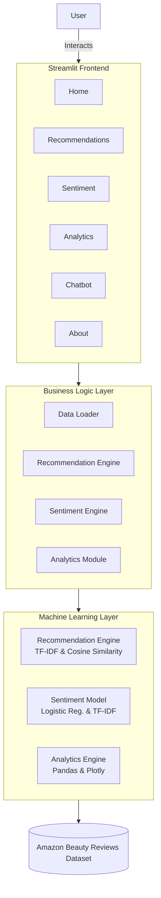
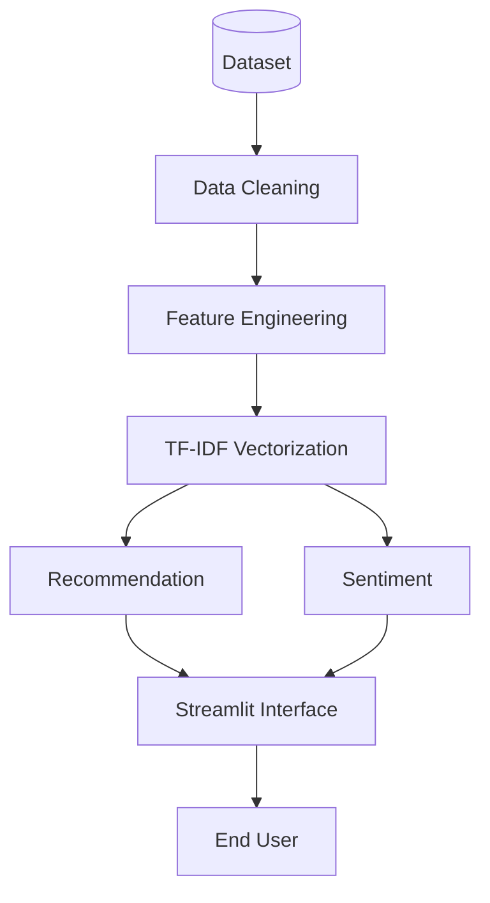

# System Architecture

## Overview

BeautyAI follows a modular architecture that combines an interactive Streamlit frontend with Machine Learning and Natural Language Processing models to provide personalized beauty product recommendations, sentiment analysis, and business insights.

The application is divided into four major layers:

- Presentation Layer (User Interface)
- Business Logic Layer
- Machine Learning Layer
- Data Layer

## High-Level Architecture

## Architecture Layers

### 1. Presentation Layer

The Streamlit frontend provides an intuitive interface for users to interact with the application.

**Features include:**
- Product Recommendation
- Sentiment Analysis
- Analytics Dashboard
- AI Chat Assistant
- Product Search
- Interactive Visualizations

### 2. Business Logic Layer

This layer connects the frontend with the machine learning models.

**Responsibilities:**
- Loading datasets
- Data preprocessing
- Model inference
- Recommendation generation
- Analytics computation
- Error handling

### 3. Machine Learning Layer

The AI engine consists of two independent models.

#### Recommendation System

**Technique:** Content-Based Filtering
**Algorithms:** TF-IDF Vectorization, Cosine Similarity
**Purpose:** Recommend products with similar textual characteristics based on customer reviews and product information.

#### Sentiment Analysis

**Technique:** Supervised Machine Learning
**Algorithm:** Logistic Regression
**Feature Extraction:** TF-IDF Vectorization
**Purpose:** Predict whether a customer review expresses positive or negative sentiment.

#### Analytics Engine

**Generates business insights using:** Pandas, NumPy, Plotly
**Provides:**
- Rating Distribution
- Review Trends
- Category Analysis
- Top Products
- Customer Insights

## Data Flow

## Technology Stack

| Layer | Technologies |
|---|---|
| Frontend | Streamlit |
| Backend | Python |
| Machine Learning | Scikit-learn |
| NLP | TF-IDF |
| Recommendation | Cosine Similarity |
| Sentiment Analysis | Logistic Regression |
| Visualization | Plotly, Matplotlib |
| Data Processing | Pandas, NumPy |

## Advantages of the Architecture

- Modular design
- Easy maintenance
- Separation of concerns
- Reusable ML models
- Scalable for future enhancements
- Easy integration with APIs and cloud services
