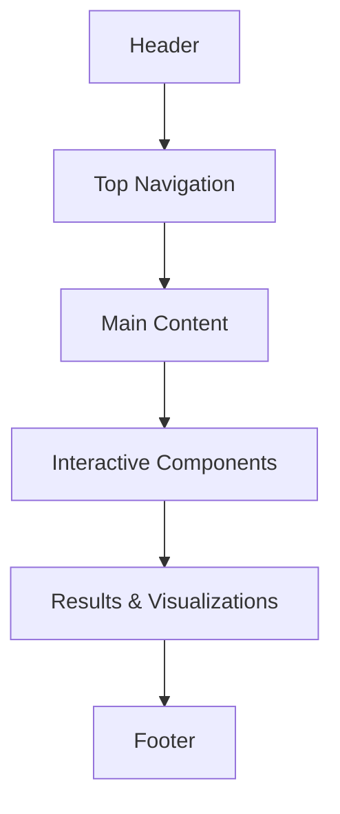
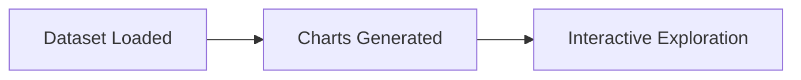

# UI/UX Design Documentation

## Overview

The BeautyAI user interface was designed with the objective of creating a clean, intuitive, and engaging experience for users exploring beauty product recommendations, sentiment analysis, and analytics. The design emphasizes simplicity, readability, and ease of navigation while maintaining a modern aesthetic.

The application follows a user-centered design approach, ensuring that complex AI functionalities remain accessible to both technical and non-technical users.

## Design Goals

The primary design objectives of BeautyAI are:
- Create a clean and modern interface.
- Simplify user interaction with AI-powered features.
- Present analytical information in an easy-to-understand format.
- Reduce cognitive load through intuitive navigation.
- Maintain visual consistency across all pages.

## Design Principles

The interface is built around the following design principles:

### Simplicity
The application avoids unnecessary visual clutter and presents information in a structured manner.

### Consistency
Colors, typography, buttons, spacing, and layouts remain consistent throughout the application to provide a familiar user experience.

### Accessibility
Readable fonts, sufficient spacing, and intuitive navigation improve usability for a wide range of users.

### Responsiveness
Layouts are designed to adapt smoothly across different screen sizes supported by Streamlit.

## Application Pages

The BeautyAI application consists of the following primary pages:

### Home
- **Purpose:** Introduces the application, highlights key features, and provides quick navigation to different modules.

### Product Recommendation
- **Purpose:** Allows users to search and select beauty products, displays AI-generated recommendations, and shows product information alongside recommendation results.

### Sentiment Analysis
- **Purpose:** Accepts customer review text, predicts review sentiment, and displays positive or negative classification.

### Analytics Dashboard
- **Purpose:** Presents business insights through interactive visualizations and enables users to explore customer review trends.

### AI Chat Assistant
- **Purpose:** Provides conversational assistance, helps users navigate the application, and answers product-related queries (where supported).

### About
- **Purpose:** Explains the project, describes the technologies used, and provides developer information.

## Navigation Design

The application follows a simple page-based navigation model. *Note: BeautyAI hides the default Streamlit sidebar in favor of a beautiful custom top navigation bar for a premium feel.*

**Benefits include:**
- Easy access to all modules.
- Consistent navigation across pages.
- Reduced learning curve for first-time users.

## Color Palette

BeautyAI uses a soft and modern color palette inspired by beauty and wellness applications.

| Color | Purpose |
|---|---|
| Pink | Primary accent |
| White | Background |
| Light Gray | Cards and containers |
| Dark Gray | Primary text |
| Green | Success indicators |
| Red | Error messages |

The palette enhances readability while creating a visually appealing experience.

## Typography

Typography was selected to maximize readability and visual hierarchy.

**Guidelines include:**
- Large headings for section titles.
- Medium-sized subheadings.
- Clear body text.
- Consistent font weights.
- Adequate line spacing for readability.

## Layout Structure

Each page follows a consistent layout pattern:



This predictable structure allows users to quickly locate information and interact with application features.

## User Interaction Flow

### Recommendation Module
```mermaid
flowchart LR
    U[User Selects Product] --> B[Click "Recommend"]
    B --> E[Recommendation Engine]
    E --> R[Recommended Products Displayed]
```

### Sentiment Analysis Module
```mermaid
flowchart LR
    U[User Enters Review] --> B[Click "Analyze"]
    B --> P[Sentiment Prediction]
    P --> R[Result Displayed]
```

### Analytics Module


## UI Components

The interface consists of several reusable components, including:
- Custom Top Navigation Bar
- Search Boxes
- Dropdown Menus
- Custom Recommendation Cards
- Metric/KPI Cards
- Interactive Charts
- Buttons
- Text Input Fields
- Floating AI Chat Popover

These components ensure consistency and improve maintainability.

## User Experience Considerations

The application was designed to provide a smooth user experience through:
- Clear page organization.
- Logical workflow progression.
- Immediate visual feedback for user actions.
- Interactive visualizations.
- Minimal user input requirements.
- Consistent design language.

## Accessibility

The application incorporates several accessibility practices:
- Clear typography.
- High-contrast text.
- Descriptive labels.
- Simple navigation.
- Consistent spacing.
- Readable chart layouts.

*Future improvements include keyboard navigation and enhanced screen reader support.*

## Current Limitations

The current UI has a few limitations:
- Limited mobile responsiveness due to Streamlit.
- Restricted animation capabilities.
- Basic navigation compared to modern web frameworks.
- Limited customization of native Streamlit components.

## Future UI/UX Enhancements

Planned improvements include:
- Advanced Floating AI assistant capabilities.
- Product detail pages.
- Interactive product cards with dynamic images.
- Dark mode support.
- Advanced search and filtering.
- Smooth page transitions.
- Enhanced animations.
- Migration to a Next.js frontend with a FastAPI backend for greater flexibility and scalability.

## Design Decisions

Several key design decisions guided the development of BeautyAI:
- **Streamlit** was selected for rapid prototyping and seamless integration with Python-based machine learning models.
- A **modular page structure** was adopted to separate recommendations, sentiment analysis, analytics, and project information.
- **Interactive visualizations** were prioritized to improve data exploration.
- A **clean visual style** was chosen to keep the focus on AI-powered functionality while ensuring an intuitive user experience.

## Conclusion

The BeautyAI interface combines modern design principles with an intuitive user experience to make AI-driven product recommendations, sentiment analysis, and analytics accessible to a broad audience. By emphasizing clarity, consistency, and usability, the application provides an engaging platform for exploring beauty product insights while maintaining a scalable foundation for future enhancements.
